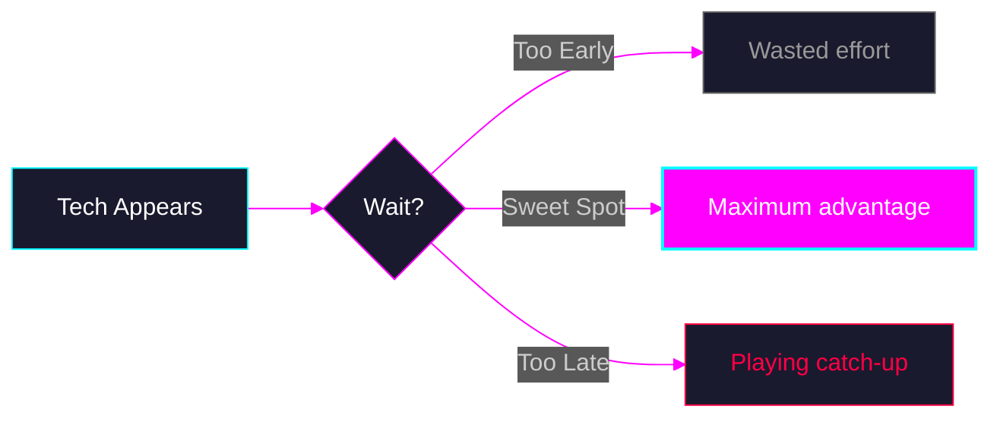

<h1 class="text-6xl! font-bold">How to Start a Product Using AI</h1>

  
  
  

  Press Space to continue <carbon:arrow-right class="inline animate-pulse" />

<!--
Welcome everyone. Today we're going to talk about something that's on everyone's mind - how to actually start building products in this new AI-powered world.
-->

---
layout: default
class: px-16
transition: pixel
---

# The Timing Paradox

"Don't adopt too early"

"Wait for things to stabilize"

"Let others be guinea pigs"

"Mature tech is safer"

This advice has served us well for decades. But...

<!--
Traditionally, we've been told to wait. Don't adopt too early. Let things stabilize.

And that advice has been GOOD. It saved us from betting on technologies that died.

BUT - and this is a big but - there's a catch...
-->

---
layout: center
class: text-center px-20
transition: cyber
---

Quick poll:

Do you feel we're still in time to integrate AI, 
or are we already playing catch-up?

<!--
Quick show of hands. How many of you feel we're still in time to integrate AI into our workflows?

And how many feel we're already playing catch-up?

Interesting. Let me share my perspective on this...
-->

---
layout: default
class: px-16
transition: corrupt
---

# AI Agents Amplify Skill, Not Replace It

Source: Eric Zakariasson

<!--
Here's data that should give you confidence. Eric Zakariasson found that senior engineers actually ACCEPT more AI output than juniors.

Why? Because seniors write better prompts - they know what they want. They break down problems into pieces an AI can handle. And they can VERIFY the output quickly because they already know what good code looks like.

Juniors? They can generate code all day, but they don't have the experience to know if it's actually correct.
-->

---
layout: center
class: text-center
transition: pixel
---

<BigStatement
  primary="Coding agents amplify existing engineering skill."
  secondary="Not replace it."
>
  

    Your fundamentals are your superpower.
  

</BigStatement>

<!--
This is the key takeaway. AI amplifies what you already have.

If you're good - AI makes you GREAT.
If you're mediocre - AI makes you... still mediocre, just faster at being mediocre.

Your fundamentals are your superpower. Design patterns, architecture, understanding how things work under the hood - THAT's what makes you effective with AI.
-->

---
layout: center
class: text-center
transition: cyber
---

<FeatureCard title="1. Mindset" description="How to think about AI as a collaborator" color="pink" />

<FeatureCard title="2. Tools" description="The essential stack for AI-powered development" color="fuchsia" />

<FeatureCard title="3. Workflow" description="Practical patterns for shipping faster" color="purple" />

<!--
So this presentation - consider it your manual. The one Karpathy said doesn't exist.

We'll cover three things: the right mindset, the essential tools, and practical workflows.

Let's get started.
-->

---
layout: center
class: text-center
transition: glitch
---

<SectionDivider
  section="SECTION_01"
  title="Part 1: Mindset"
  subtitle="The trust spectrum and why your experience matters more than ever"
  accent-color="cyan"
/>

<!--
Let's start with mindset. Because I've talked to many of you, and I know there's resistance. And honestly? That resistance comes from a good place.
-->

---
layout: default
class: px-16
transition: vhs
---

# The Trust Spectrum

✍️

100% Manual

"I write every line"

Most devs here

🤖

100% AI

"Zero manual code"

<ContrastBox
  label="The fear:"
  text="Use IA is not ready for production. It's untrustworthy."
  variant="negative"
/>

<ContrastBox
  label="The reality:"
  text="&quot;I'm a programmer who now has a junior dev that never sleeps&quot;"
  variant="positive"
/>

<!--
Here's the trust spectrum. On one end - 100% manual code. On the other - Guillermo Rauch saying some Vercel features have ZERO manual code.

Most of us are somewhere on the left. And I get it - there's this fear that if AI writes the code, we're not real programmers.

But here's the reframe: you're still the programmer. You just have a junior dev that never sleeps, never complains, and types at 1000 words per minute.
-->

---
layout: quote
class: text-center
transition: corrupt
---

# Guillermo Rauch reviewed a PR for an important feature at Vercel.

<v-clicks>

Perfect code. Great documentation. Full test coverage.

He asked the developer: "How much was AI-assisted?"

"100%"

</v-clicks>

This is the future. It's happening RIGHT NOW.

<!--
Let that sink in. Guillermo Rauch. The guy who created Next.js. CEO of Vercel.

He reviewed a PR for a really important feature at Vercel. The code was perfect - great documentation, full test coverage. It was so good he asked how much was AI-assisted. The developer said 100%.

This isn't some future prediction. This is happening RIGHT NOW at top-tier tech companies.
-->

---
layout: center
class: text-center px-16
transition: cyber
---

The mindset shift:

<BigStatement
  primary="From &quot;writing code&quot; to &quot;directing code&quot;"
  primary-effect="neon-magenta"
  :secondary="undefined"
>
  

    You're not losing control. You're gaining leverage.
  

</BigStatement>

<!--
Here's the mindset shift you need to make.

You're going from WRITING code to DIRECTING code. Think of yourself as a film director - you're not holding the camera, but you're absolutely in control of the vision.

You're not losing control. You're gaining leverage.
-->

---
layout: center
class: text-center
transition: glitch
---

<BigStatement
  primary="Small city ≠ small impact"
  primary-effect="neon-cyan"
>
  

    The playing field just got leveled.
  

  

    The only question is: will you claim your boost?
  

</BigStatement>

<!--
Small city does NOT mean small impact anymore.

The playing field just got leveled. Seriously.

The only question now is: will you claim your boost? Or will you let it be a "skill issue" like Karpathy said?
-->

---
layout: center
class: text-center
transition: corrupt
---

<SectionDivider
  section="SECTION_02"
  title="Part 2: Tools"
  subtitle="The stack that makes AI actually useful"
  accent-color="magenta"
/>

<!--
Now let's talk tools. But first, we need to talk about a problem most of us don't even realize we have.
-->

---
layout: center
class: text-center px-16
transition: pixel
---

Be honest with yourself:

How much time do you spend fighting your tools instead of using them?

<v-click>

Context scattered across Notion, Slack, Jira, Google Docs, Figma... 
Every tool is another tab. Another context switch. 
Another place where knowledge goes to die.

</v-click>

<!--
Be honest. How much time do you spend fighting your tools instead of actually building?

Your context is scattered everywhere. Notion for docs, Slack for discussions, Jira for tickets, Google Docs for specs, Figma for designs...

Every tool is another tab. Another context switch. Another place where knowledge goes to die.
-->

---
layout: center
class: text-center
transition: vhs
---

The insight that changed everything:

What if AI could not just read your knowledge base, but actually operate it?

<!--
Here's the insight that changed how I work.

What if AI could not just READ your knowledge base... but actually OPERATE it?

Merge PRs. Create issues. Update documentation. All from the same context.
-->

---
layout: default
class: px-16
transition: glitch
---

# The Solution: Text-Based, Version-Controlled, AI-Native

<FeatureCard v-click icon="📝" title="Text-Based" description="Markdown files. No proprietary formats. Works with any editor. AI can read AND write." color="pink" />

<FeatureCard v-click icon="🔄" title="Version-Controlled" description="Everything in Git. Full history. Diffs. Collaboration via PRs. Auditable." color="fuchsia" />

<FeatureCard v-click icon="🤖" title="AI-Native" description="AI can discover, read, modify, and commit. Same access you have." color="purple" />

<CalloutBox v-click color="gray" class="mt-8 text-center">

**The future of company operations looks more like a git repo than a SaaS dashboard.**

</CalloutBox>

<!--
The solution has three properties.

Text-based - markdown files, no proprietary formats. AI can read AND write.

Version-controlled - everything in Git. Full history, diffs, collaboration.

AI-native - the AI has the same access you have. It can discover, read, modify, and commit.

The future of operations looks more like a git repo than a SaaS dashboard.
-->

---
layout: default
class: px-16
transition: corrupt
---

# Why Markdown is the Secret Weapon

<MarkdownDoc
  filename="SF-0039.md"
  maxHeight="380px"
  :meta="{
    id: 'SF-0039',
    title: 'Setup Email Service Integration (Sendgrid/Postmark)',
    type: 'task',
    status: 'backlog',
    priority: 'P0',
    complexity: 'Medium',
    dependencies: ['SF-0001'],
    tags: ['email', 'infrastructure', 'sendgrid'],
    assignee: 'unassigned',
    created_date: '2026-01-26'
  }"
>

# 🎯 Objective
Configure email service provider for transactional emails (verification, notifications, reminders).

# 🧠 Context & Why
IR-001 specifies email integration. Client does not have existing email service (Client Decision Jan 2026). We need to set up Sendgrid or Postmark, configure SPF/DKIM/DMARC for deliverability, and create the infrastructure for all email types.

# ✅ Acceptance Criteria (Definition of Done)
- [ ] Email provider selected (Sendgrid recommended for pricing)
- [ ] API key configured in environment variables
- [ ] SPF record configured for sending domain
- [ ] DKIM configured for email signing
- [ ] DMARC policy configured
- [ ] Verified sending domain
- [ ] Test email sent successfully
- [ ] Email service wrapper created (`src/lib/email/`)
- [ ] Support for:
  - [ ] Send single email
  - [ ] Send templated email
  - [ ] Batch send
- [ ] Error handling and retry logic
- [ ] `email_logs` table integration
- [ ] Bounce/complaint webhook handler (optional for MVP)

# 🛠️ Technical Implementation Strategy
*   **Affected Areas:** `src/lib/email/`, environment config, DNS records
*   **Constraints:** 
    - Use SDK provided by email service
    - Abstract provider (easy to switch Sendgrid ↔ Postmark)
    - Store credentials in environment variables ONLY
*   **Out of Scope:** Marketing emails, newsletter

# 🔗 References & Dependencies
*   IR-001 in REQUIREMENTS.md
*   [Sendgrid API](https://docs.sendgrid.com/)
*   **Blockers:** SF-0001 (infrastructure), Client decision on domain

</MarkdownDoc>

<v-clicks>

✓ AI can parse the structure

✓ AI can update the checkboxes

✓ AI can link to actual code files

✓ AI can create the GitHub issue

✓ Git tracks every change

✓ You can review via PR

</v-clicks>

<!--
Let me show you why markdown is the secret weapon.

Look at this simple feature spec. It's just markdown. But AI can parse the structure, update the checkboxes, link to actual code files, create the GitHub issue from it.

And because it's in Git, every change is tracked. You can review AI's changes via PR just like you'd review a human's code.
-->

---
layout: center
class: text-center
transition: pixel
---

Markdown is not just documentation.

It's your source of truth that AI can actually use.

<v-click>

Your tasks. Your specs. Your decisions. Your business logic. 
All in a format AI can read, understand, and act on.

</v-click>

<!--
Markdown is not just documentation.

It's your source of truth that AI can actually use.

Your tasks, your specs, your decisions, your business logic - all in a format AI can read, understand, and act on.
-->

---
layout: default
class: px-16
transition: cyber
---

# My Stack (Accessible & Affordable)

<ToolCard v-click icon="⌨️" name="Claude Code" description="Terminal-based AI coding agent" price="$20/month (Pro)" color="pink" />

<ToolCard v-click icon="💻" name="Open Code + Copilot" description="Open source Claude Code alternative" price="$10/month" color="fuchsia" price-color="green" />

<ToolCard v-click icon="📝" name="VSCode + Copilot" description="For quick edits and autocomplete" price="$10/month" color="purple" />

<v-click>

Total: ~$30/month for a complete AI-powered workflow

That's less than a Netflix + Spotify subscription

</v-click>

<!--
Here's my actual stack. Nothing fancy, nothing expensive.

Claude Code - $20 a month for Pro. This is my main workhorse.

Open Code - completely free, open source alternative. You bring your own API key.

VSCode with Copilot - $10 a month for quick edits and autocomplete.

Total? About $30 a month. That's less than Netflix and Spotify combined.
-->

---
layout: center
class: text-center
transition: bug
---

<SectionDivider
  section="SECTION_03"
  title="Part 3: Workflow"
  subtitle="Practical patterns for shipping faster with AI"
  accent-color="purple"
/>

---
layout: center
class: text-center
transition: glitch
---

  

  

  

  

  WORKFLOWS

  Want to go deeper?

  Interested in a Workshop?

  If there's interest, we could do a hands-on session. 
  Prompting strategies. Tool integration. Automation patterns.

  Live coding
  Real projects
  Q&A

<!--
So workflows - this is where things get really practical. But honestly, this deserves its own dedicated session.

If there's enough interest, we could organize a hands-on workshop. Real coding, real projects, real problems.

Let me know after if that sounds interesting to you.
-->

---
layout: center
class: text-center
transition: cyber
---

  
Introducing

  

    Coyomi Labs
  

  Building the future of AI-powered development.

  
🔧

  
Tools

  
Open source AI workflow tools

  
💼

  
Consulting

  
AI integration for teams

  
🎓

  
Training

  
Workshops & courses

<!--
And one more thing.

I'm launching something new. Coyomi Labs.

This is my new company focused on AI-powered development. We're building tools, offering consulting for teams who want to integrate AI, and running training programs like the workshop I just mentioned.

If any of this resonates with you - the tools, the consulting, the training - let's talk.

Thank you all for your time today. Questions?
-->
